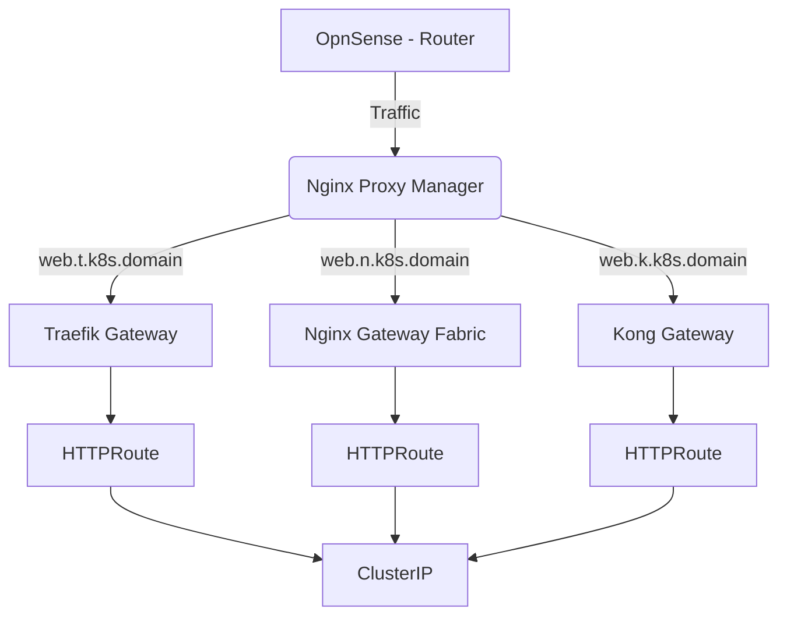

# K8S Cluster Setup
This is a repository for setting up and managing a K8S cluster because of fun.
I use it mainly to learn more about Kubernetes and stuff like converting docker-compose files to k8s.

To have a persistent storage for the cluster, I use NFS server running on a separate machine.
It provides persistent volumes with nfsStorageClass and provisioner.
It works for me with the [nfs-subdir-external-provisioner](https://github.com/kubernetes-sigs/nfs-subdir-external-provisioner).

## VM Specs
- 3x Talos nodes
- 1x NFS server

1. Talos nodes (1c, 2w):
   - 2 vCPU
   - 6 GB RAM
   - 8-16 GB Storage

2. NFS server (storage):
   - 4 vCPU
   - 2 GB RAM
   - 32 GB Storage

3. 1 LXC Container (all k8s files):
   - 1 vCPU
   - 1 GB RAM
   - 8 GB Storage

---

# Gateways

I also tested something with the Gateways, where i deployed 3 side by side and tested how good they run.
I did it because i need an alternative to the Ingress Controller.
More information in the README.md file in the Gateway Directory.

Domain = tablettenschrank.de
- [Traefik Gateway](https://github.com/traefik/traefik?tab=readme-ov-file) = https://web.t.k8s.tablettenschrank.de
- [Nginx Gateway Fabric](https://github.com/nginx/nginx-gateway-fabric) = https://web.n.k8s.tablettenschrank.de
- [Kong Gateway](https://developer.konghq.com/kubernetes-ingress-controller/) = https://web.k.k8s.tablettenschrank.de

#### A simple flowchart how i set it up:

